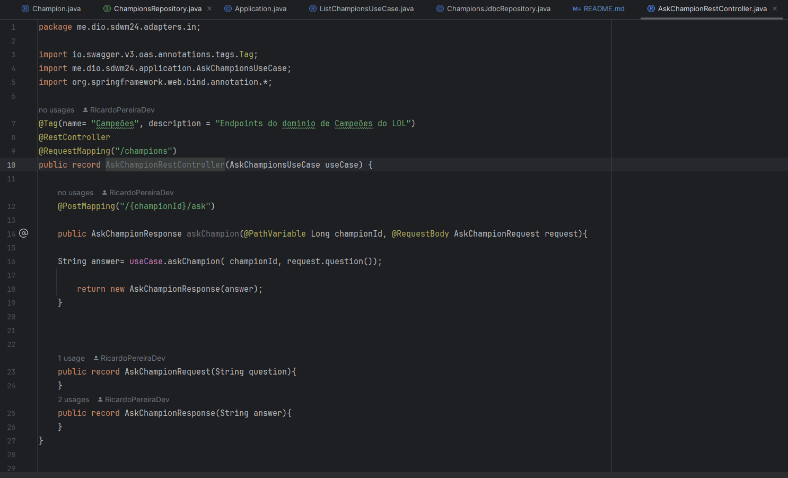

# Chat-with-league-of-legends-champions

## 1ª parte do projecto: 

### - Visão geral da arquitectura

Basicamente construi um projecto do Zero usando Spring initializer, configurei um arquivo “application.yml” e um arquivo de “data.sql” e com isso já tenho o banco de dados carregado com as informações que irei precisar.

Vou querer usar uma API, conectar com o banco de dados em memoria(H2) e irei comunicar com uma API externa.

### Configuração usada na imagem infra:

Depois fiz uma configuração de banco de dados e configurei um script de inicialização e isso já fez com que os dados subissem e funcionasse como deve ser.
A seguir mapeei qual vai ser a entidade/modelo que vai encapsular aquelas informações que estão no banco de dados, todas as informações que estão no banco fazem parte do modelo, é um reflexo do nosso banco de dados.

### Objectivo final: 
é expor esses dados através de uma API, expor os endpoints, essas informações de todos os campeões, buscar um campeão por Id ou de perguntar alguma coisa para o campeão.

## 2ªParte do Projecto:

### - Trabalhei essencialmente na Exposição dos dados

Aqui criei alguns controladores REST como por exemplo o da imagem infra para expor os endpoints principlamente o da listagem de campeões mas também já adiantei este aqui “AskChampionRestController” para fazer uma questão para o campeão.

